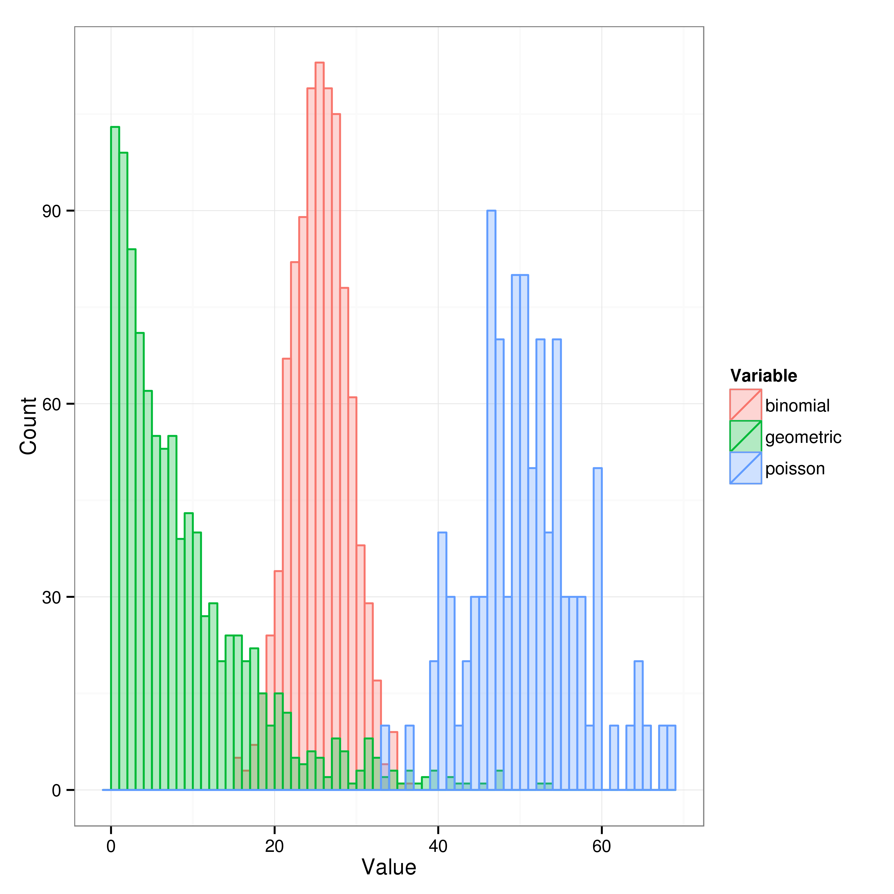
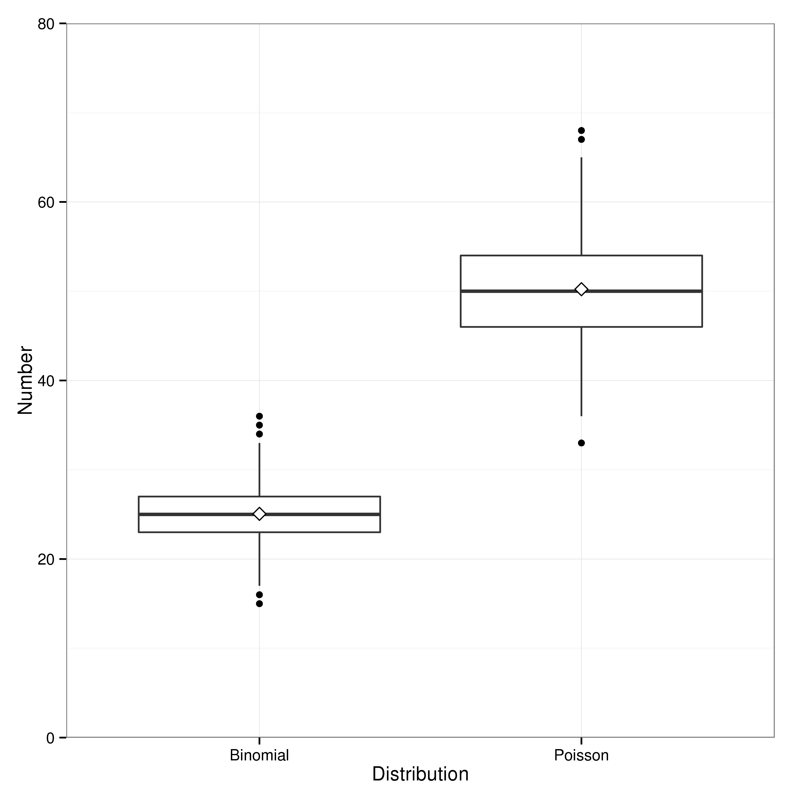
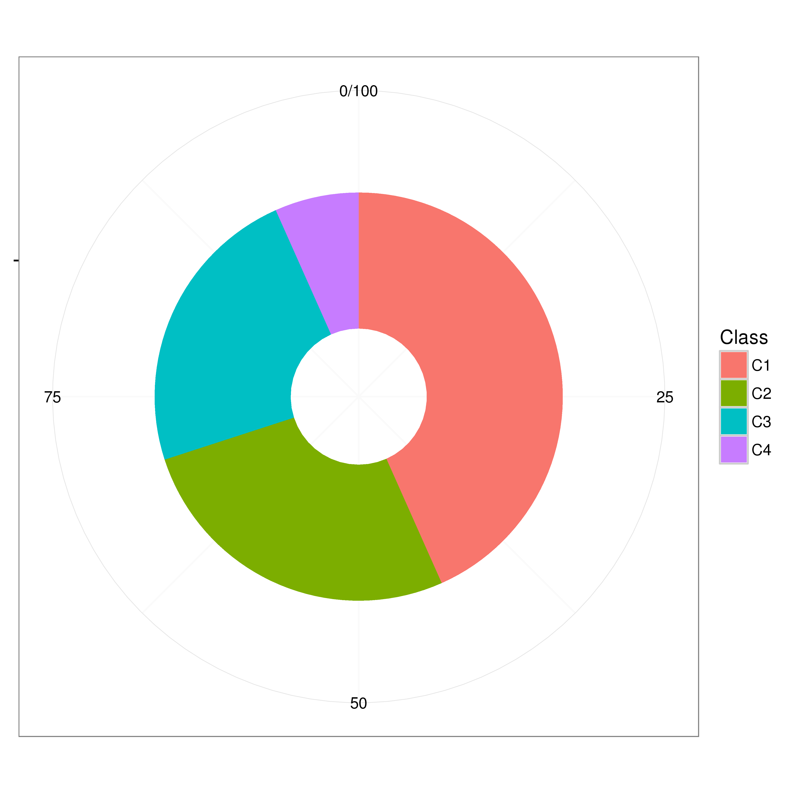
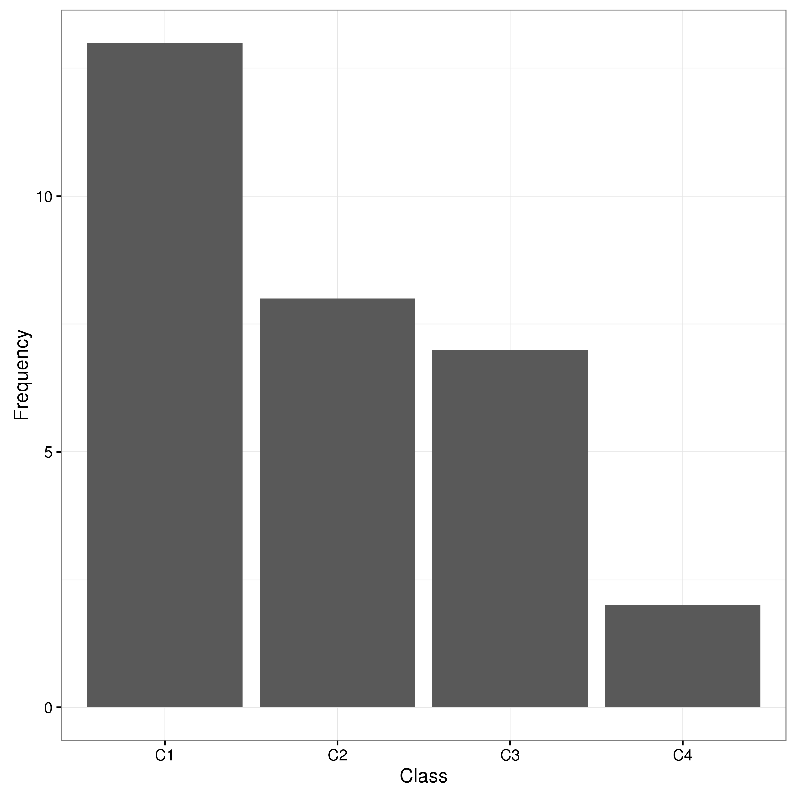
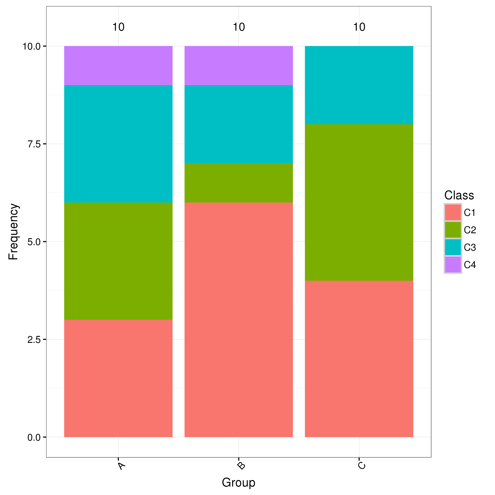
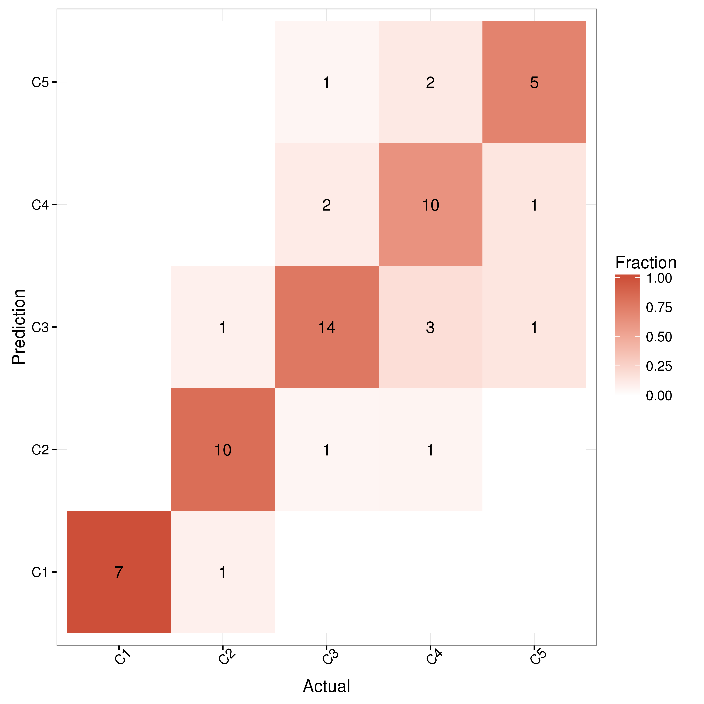
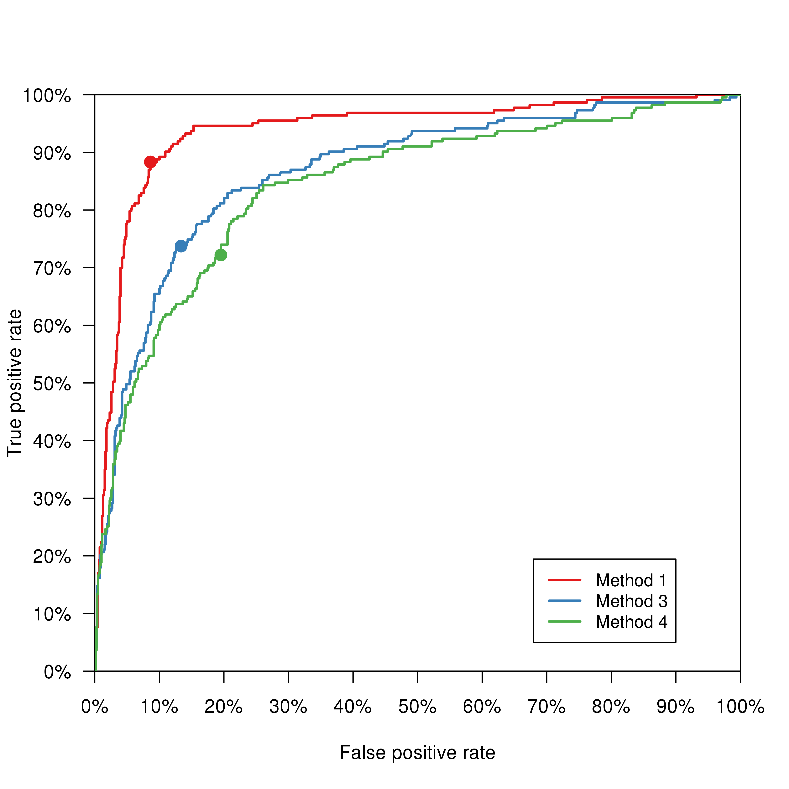
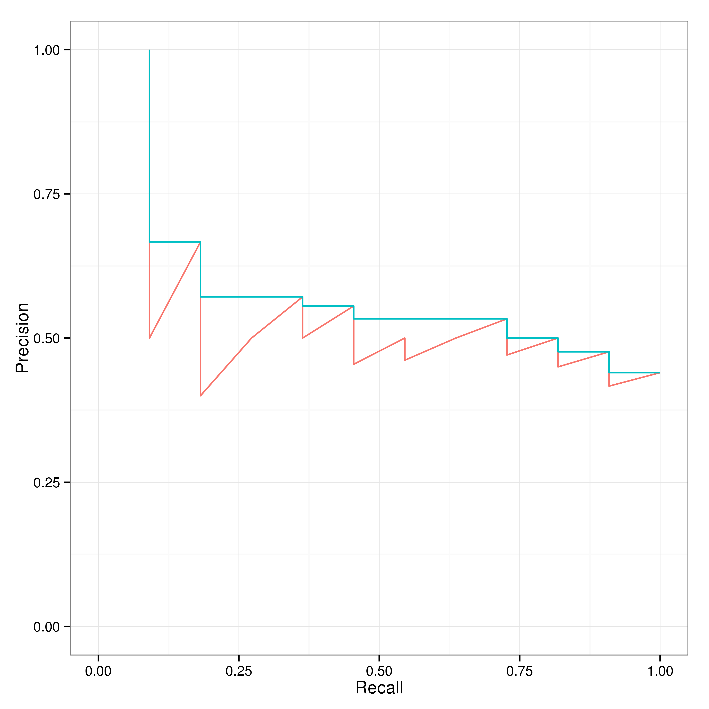
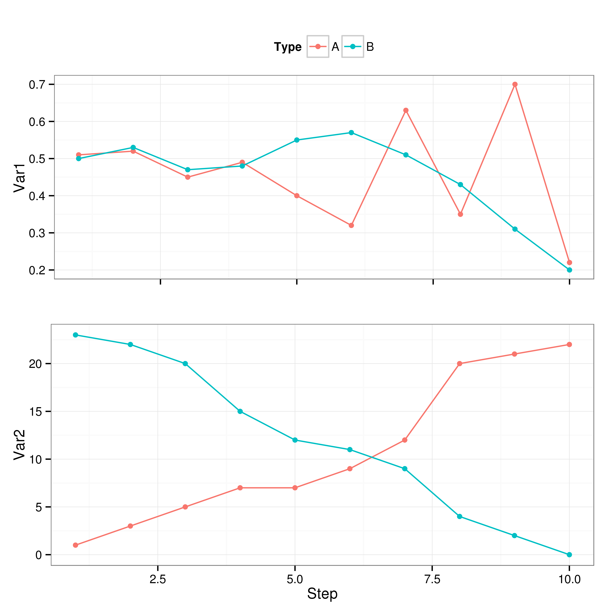
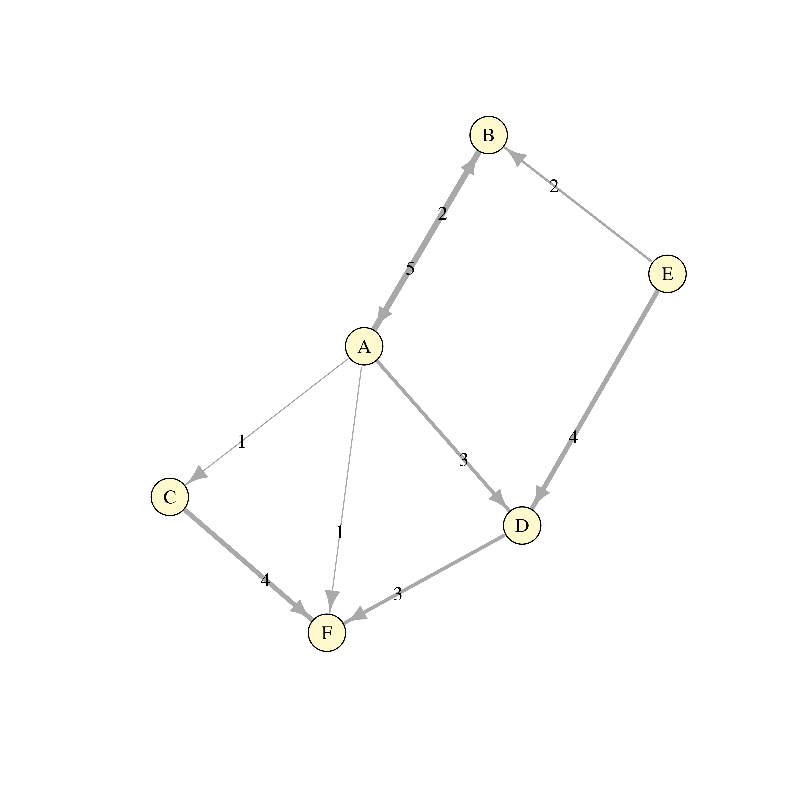

#Science-Graphics
Collection of R scripts to generate common science figures directly from the Linux command line.

## Goal
The purpose of this repository is to provide **nicely formatted figures** in R directly from **raw data files** obtained from algorithms or programs by simply running a single **command line** in the Linux shell. 
The main purpose is to automate the pipeline from data mining calculations to **publication** visualizations.

Note that each script (which generates a single figure and an optional text output) is very specific for a single type of analysis, so the scope of the repository is limited. 
However, the framework allows the easy extension of support for new applications.

## Installation & Usage
1. Make sure you have the [R](https://cran.r-project.org) programming language (version `3.0.2` or higher) installed in your system and that `Rscript` is in your path.
2. Clone locally this github repository wherever you want (`git clone https://github.com/lafita/science-graphics.git`).
3. Open a new terminal window and move to the **science-graphics** directory.
4. Allow execution access to all the scripts (`chmod 744 *.R`)
5. Run the [InstallDependencies.R](InstallDependencies.R) script to install all the required R packages.
6. From the **science-graphics** directory ([why do I need to stay in the science-graphics directory?](https://github.com/lafita/science-graphics/issues/12)), now you can run any of the other scripts.

```bash
cd /path/to/science-graphics
./Script.R [options]
./Script.R -h # print help options
./Script.R -i input.tsv -o ouput.png # an example
```

## Figures
The supported graphical visualisations are described here and example figures and input formats are shown alongside.
The scripts are divided into six categories: 

1. [Distribution](#1-distribution)
2. [Correlation](#2-correlation)
3. [Classification](#3-classification)
4. [Ranking](#4-ranking)
5. [Evolution](#5-evolution)
6. [Networks](#6-networks)

### 1. Distribution
The shared code for all scripts is in [Distribution.R](source/Distribution.R).

#### 1.1. Continuous Distributions
Continuous variable distributions can be represented by histograms, density curves, box plots or violin plots. The input can be given with a single file, where each column contains a collection of observations: [example](examples/distributions.csv).

Use the [ContinuousDistribution.R](ContinuousDistribution.R) script to calculate statistics and generate a figure from multiple variable distributions.

##### 1.1.1. Histogram
For a set of continuous variables in the same units, the **hist** type option plots their histograms slightly transparent in the same plot.

```bash
./ContinuousDistribution.R -i examples/distributions.csv 
                           -o examples/distributions_hist.png
                           -t hist --bin 1 --ylab Count
```



##### 1.1.2. Density

##### 1.1.3. Histogram & Density

##### 1.1.3. Box Plot
As the number of variables increases and their superposed densities become difficult to visualize, the alternative is to generate a box plot or violin plot. Box plots represent the mean, median and percentiles of each variable distribution, so that they can be visually compared. Use the **box** type option to generate a box plot.

```bash
./ContinuousDistribution.R -i examples/distributions.csv 
                           -o examples/distributions_box.png
                           -v Binomial,Poisson
                           -t box --ylab Number --xlab Distribution
                           --min 0 --max 80
```



##### 1.1.4. Violin Plot
However, multimodal properties of the distribution cannot be observed in a simple box plot. A violin plot is needed for that purpose. The **violin** type option allows the independent visualization of each variable distribution with its underlying boxplot.

#### 1.2. Discrete Distributions
Discrete data distributions can be represented by pie charts or bar plots, where the percentage and/or frequency of each factor of a variable can be visualized. The input is a single column with individual observations: [example](examples/contingency-table.csv) (one column).

The [DiscreteDistribution.R](DiscreteDistribution.R) script summarizes all the observations into a table of percentages and frequencies and generates a figure.

##### 1.2.1. Pie Chart
The pie chart represents the percentage of a discrete variable's factors.

```bash
./DiscreteDistribution.R -i examples/contingency-table.csv 
                         -o examples/distribution_pie.png
                         -v Class -t pie
```



##### 1.2.2. Bar Plot
The bar plot represents the frequency of a discrete variable's factors.

```bash
./DiscreteDistribution.R -i examples/contingency-table.csv 
                          -o examples/distribution_bar.png
                          -v Class -t bar
```



### 2. Correlation
The shared code for all scripts is in [Correlation.R](source/Correlation.R).

#### 2.1. Contingency Table
For discrete variables, the [ContingencyTableBarplot.R](ContingencyTableBarplot.R) plots the percentage or frequency of each discrete variable pair as a barplot. The input is a column for each variable and a row for each variable pair observation: [example](examples/contingency-table.csv).

```bash
./ContingencyTableBarplot.R -i examples/contingency-table.csv 
                            -o examples/contingency-table.png
                            --value Frequency -p stack
                            -v Group,Class
```



### 3. Classification
The shared code for all scripts is in [Classification.R](source/Classification.R).

#### 3.1. Confusion Matrix Plot
The most detailed representation of a classifier result is the [confusion matrix](https://en.wikipedia.org/wiki/Confusion_matrix). 
The script [ConfusionMatrix.R](ConfusionMatrix.R) calculates the confusion matrix for a collection of predictions and plots each entry of the matrix as a tile colored by the fraction of the predicted class for its actual class. The plot also shows the total number of predictions (the matrix entry) only if it is different than 0.
The input data consists of a a column of actual (true) labels and a column of predictions: [example](examples/classification.csv).

```bash
./ConfusionMatrixPlot.R -i examples/classification.csv 
                        -o examples/confusion-matrix.png
```



#### 3.2. ROC Curve
The [Receiver Operating Characteristic (ROC)](https://en.wikipedia.org/wiki/Receiver_operating_characteristic) curve is a graphical plot that illustrates the performance of a binary classifier system as its discrimination threshold is varied. 
The curve is created by plotting the true positive rate (TPR) against the false positive rate (FPR) at various threshold settings.
Two types of input formats are accepted:
- [StAR](http://melolab.org/star): two files, one containing the positive cases and another containing the negative cases. Each of the files contains a column for each prediction method with the scores for each case (rows). Example: [positive](examples/ROC_positive.csv) and [negative](examples/ROC_negative.csv).
- [easyROC](http://www.biosoft.hacettepe.edu.tr/easyROC/): a single file with a column for each prediction method with the scores for each case (rows) and an additional column with the case status (1 if positive, 0 if negative): [example](ROC.csv).

```bash
# StAR
./RocCurve.R -p examples/ROC_positive.csv 
             -n examples/ROC_negative.csv 
             -o examples/roc-curve.png

# easyROC
./RocCurve.R -i examples/ROC.csv 
             -o examples/roc-curve.png
```



### 4. Ranking
The [Ranking.R](source/Ranking.R) source file contains functions to visualize and evaluate the performance of a **ranking algorithm**.
The results must have a **relevance score**, which can be binary (0 is non-relevant, 1 is relevant), discrete (e.g, scale of relevance from 1 to 5, 5 being the most relevant) or continuous (e.g, relevance score between 0 and 1).
The ranking algorithm returns an input set sorted by relevance, where most relevant relevant inputs are at the top (beginning).
Given the position of each input in the resulting sorted set and its relevance score, the performance of the algorithm is determined by a score that trades-off precision and recall in the ranking list.

#### 4.1. Precision-Recall Curve
For binary relevance scores, the [PrecisionRecallCurve](scripts/PrecisionRecallCurve.R) script plots the precision in function of the recall, what is called PR curve.
The input consists of an optional **Name** column and a **Relevance** score column, which is sorted in the ranking order returned by the algorithm (see the [example file](data/example_pr-curve.csv)).

Name | Relevance |
---|---|
Character | Numeric |


  
### 5. Evolution
The [Evolution.R](source/Evolution.R) source file contains functions to visualize variable fluctuations and evolution in function of time (ODEs), step (MC simulations), or other independent variables (like wavelength, distance, etc).

#### 5.1. Evolution Plot
The [EvolutionPlot.R](scripts/EvolutionPlot.R) script accepts as an input multiple variables (in different units) and multiple runs (or instances) and arranges them in a multiplot.
The input consists of an optional **Name** column, a **Group** column (for each run or instance), a **Independent** variable column (time, step) and multiple **Dependent** variable columns (see the [example file](data/example_evolution.csv)).

Name | Group | Independent | Dependent 1 | Dependent 2 | ... | Dependent N |
---|---|---|---|---|---|---|
Character | Factor | Numeric | Numeric | Numeric | Numeric | Numeric |


  
### 6. Networks
The [Networks.R](source/Networks.R) source file contains functions to visualize graphs.

#### 6.1. Network Graph
For a simple graph with optional weighted or labeled edges the [NetworkGraph.R](scripts/NetworkGraph.R) script can be used.
The input consists of a set of edges, specified by the columns **From** and **To**, followed by an optional **Weight** column for the edge (see the [example file](data/example_network.csv)).

From | To | Weight
---|---|---
Factor | Factor | Numeric



## Dependencies
- **R** version `3.0.2` or higher.
- Packages: 
  - `ggplot2`
  - `gridExtra`
  - `grid`
  - `reshape2`
  - `plyr`
  - `mlearning`
  - `igraph`
  - `ROCR`

## References

Some of the plots have been taken from the book *R Graphics Cookbook*, written by Winston Chang and published by O'REILLY.
