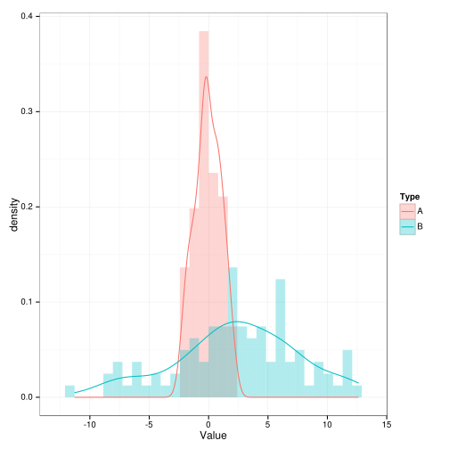
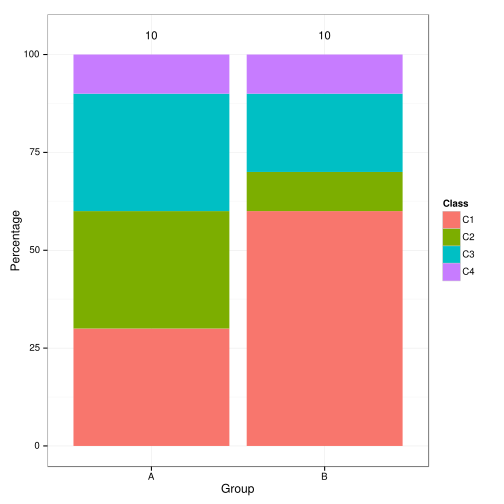
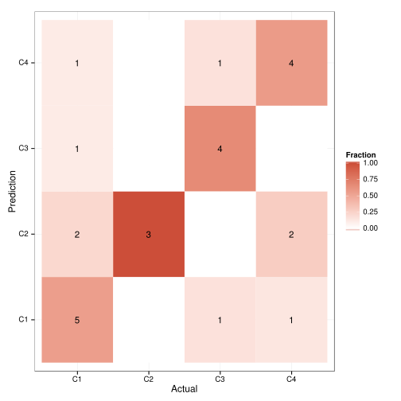
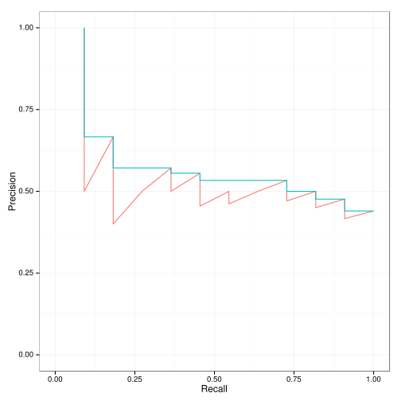
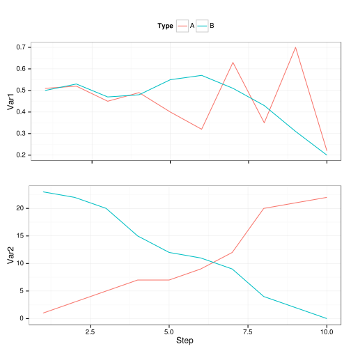

#Science-Graphics
Collection of R scripts to generate common science figures directly from the Linux command line.

## Goal
The purpose of this repository is to provide **nicely formatted figures** in R directly from **raw data files** obtained from algorithms or programs by simply running a single **command line** in the Linux shell. 
The main purpose is to automate the pipeline from data mining calculations to publication visualizations.

Note that each script (which generates a single figure and an optional text output) is very specific for a single type of analysis, so the scope of the repository is limited. 
However, the framework allows the easy extension of support for new applications.

## Supported Graphs
The supported graphical visualisations are described here and the example figures are shown alongside.
The graphs are divided into three main statistical topics: **distribution**, **correlation**, **classification**, **ranking**, **evolution** and **networks**.

### 1. Distribution

The [Distribution.R](source/Distribution.R) source file contains functions to visualize data distributions, either continuous or discrete.

For a set of continuous variables in the same units, the [MultiVariateDistribution.R](scripts/MultiVariateDistribution.R) script plots them together as a density line with their underlying histogram slightly transparent.



For discrete variables, the [GroupedMultiClassBarplot.R](scripts/GroupedMultiClassBarplot.R) represents the percentage or frequency of each class for each of the groups as a barplot.



If there is a single group, the percentage and frequency of each class can be visualized as a Pie Chart (coming soon).

### 2. Correlation

Coming soon...
  - Contingency Table
  - Correlation Plot

### 3. Classification

The [Classification](source/Classification.R) source file contains functions to visualize and analyze the performance of a classifier, which assigns a label (class) to each data point.

The most detailed representation of a classifier result is the [confusion matrix](https://en.wikipedia.org/wiki/Confusion_matrix). The script [ConfusionMatrix.R](scripts/ConfusionMatrix.R) plots each entry of the matrix as a tile colored by the fraction of the predicted class given the actual class and prints to it the total number of predictions (the matrix entry) only if it is different than 0.



Coming soon...
  - Confusion Matrix Statistics
  - ROC Curve

### 4. Ranking

[Ranking](source/Ranking.R)


  
### 5. Evolution

[Evolution](source/Evolution.R)



  
### 6. Networks

Coming soon...
  - Cyclic Graph
  - Directed Acyclic Graph (DAG)

## Usage
Save the raw data file in the correct CSV format (`projectname.csv`) in the **data** folder. 
Run the appropiate script from the command line by typing:

```bash
./Path/To/Script.R projectname  # the name of the project is without any extension
./ConfusionMatrixPlot.R example2
```

The created figures will be stored in the **figures** folder, in PDF format, as `projectname.pdf`.
Any created text result output will be stored in the **results** folder, in CSV format, as `projectname.csv`.

To clear all the generated files for one project (or a subset) you can use the [ClearProject](scripts/ClearProject.sh) script. 
It will delete any file in the **figures** and **results** folder matching the input name.
The script does not delete any of the files in the **data** folder, so the raw data will be conserved.

```bash
./ClearProject.sh projectname
./ClearProject.sh example1  # This delete figures and results of example1
./ClearProject.sh example*  # This will delete all example projects at once
```

## Dependencies
- **R** version `3.0.2` or higher.
- Packages: 
  - `ggplot2`
  - `gridExtra`
  - `reshape2`
  - `plyr`
  - `mlearning`
  - `igraph`
